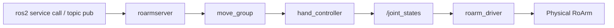

# Command Control

Move the arm with **ROS2 services** (`/get_pose_cmd`, `/move_joint_cmd`, …) and the **`/gripper_cmd`** topic — suited to scripts, terminals, and repeatable goals. Keep **`roarm_driver`** running; close other MoveIt / Servo launches before starting this stack.

For MoveIt basics, see [MoveIt2](moveit2.md).  
For frames and `hand_tcp`, see [RoArm Basics](roarm_basics.md).  
For serial and `roarm_driver`, see [Hardware Driver](driver_control.md).

---

## Prerequisites

Before launching MoveIt Cmd:

1. **Build and source** **`roarm_ws`** ([Installation](installation.md)).
2. Set **`ROARM_MODEL`** and **`GRIPPER_TYPE`** to match your hardware — see [Environment variables](installation.md#environment-variables). (`GRIPPER_TYPE` selects the roarm_m2 gripper mesh; on roarm_m3 either value is fine but must be set.)
3. **Close any other RViz session** — for example `display.launch.py` ([Robot Description](description.md)), `roarm_moveit.launch.py` ([MoveIt2](moveit2.md)), or `servo_control.launch.py` ([Keyboard Control](keyboard_control.md)). In that terminal, press **`Ctrl+C`**.
4. [**Start `roarm_driver`**](driver_control.md#run-the-driver) in **Terminal 0** and leave it running.

!!! warning "Safety"
    With **`roarm_driver` running**, the real arm moves when you launch Cmd (**`initial_positions.yaml`**), when a motion service succeeds, and when you publish **`/gripper_cmd`**. Clear the area around the arm and keep hands away from pinch points **before** launching and before each service call.

---

## MoveIt Servo vs MoveIt Cmd

Both use the same URDF and `/joint_states`, but the workflow is different.

| | **MoveIt Servo** ([Keyboard & Gamepad](keyboard_control.md)) | **MoveIt Cmd** (this page) |
|---|-----|-----|
| **Launch** | `roarm_moveit_servo servo_control.launch.py` | `roarm_moveit_cmd command_control.launch.py` |
| **Purpose** | **Teleop** — jog the arm while you hold keys / sticks | **Discrete goals** — move to a pose or path from CLI or code |
| **Input** | Keyboard (`keyboardcontrol`) or gamepad (`/joy`) | `ros2 service call …` and `ros2 topic pub /gripper_cmd …` |
| **Motion style** | Continuous small streams while input is active | **One plan + execute** per service call, then stop |
| **Target** | Relative step along planning-frame **±X / ±Y / ±Z** or joint jog | **Absolute** x/y/z (and roll/pitch/yaw on M3) in **`base_link`** via the analytical solver |
| **Planning** | `servo_node` (incremental IK) | `roarmserver` → solver IK → **`move_group`** plan & execute |
| **RViz** | `servo_control.rviz` | `command_control.rviz` (MoveIt stack; optional visualization) |
| **Gripper** | **`g`** / gamepad; **A** / **B** while jogging | **`gripper`** field in motion services (see notes below); **`/gripper_cmd`** for jaw-only moves |
| **Moves real arm?** | **Immediately** while jogging (still through `roarm_driver`) | **Immediately** while call service successful (still through `roarm_driver`) |
| **Typical use** | Manual tuning, demos, “fly the arm” | Automation, teaching points, shell scripts, integration tests |

**Data path (Cmd on hardware):** service request → **`roarmserver`** → **`move_group`** → `hand_controller` → **`/joint_states`** → **`roarm_driver`** → ESP32.

Servo and Cmd both differ from that workflow too — see the comparison tables in [Keyboard Control](keyboard_control.md) and above.

---

## Launch MoveIt Cmd

| Terminal | What to run |
|----------|-------------|
| **T0** | [`roarm_driver`](driver_control.md#run-the-driver) — already running from [Prerequisites](#prerequisites) |
| **T1** | `ros2 launch roarm_moveit_cmd command_control.launch.py use_rviz:=true` — then call services from **T1** or another sourced terminal |

In **Terminal 1** (**`install/setup.bash`** sourced). **Clear the area around the arm** before launch.

```bash
ros2 launch roarm_moveit_cmd command_control.launch.py use_rviz:=true
```

If the program no longer needs to run, use **`Ctrl+C`** to close the session.

Right after launch, the arm often **moves to `initial_positions.yaml`** on its own (for example roarm_m2 `link2_to_link3: 2.618`). **`roarm_driver` forwards that to the motors** — expect this motion; do not block the arm.

### Launch Nodes

| Node / process | Role |
|----------------|------|
| `robot_state_publisher` | URDF + `/joint_states` → TF |
| `move_group` | Plans and executes trajectories for service requests |
| `ros2_control_node` + controllers | `hand_controller`, `gripper_controller`, `joint_state_broadcaster` |
| `roarmserver` | Service API: `/get_pose_cmd`, `/move_joint_cmd`, `/move_line_cmd`, `/move_circle_cmd` |
| `setgrippercmd` | Bridges **`/gripper_cmd`** → gripper controller |
| `rviz2` | **`command_control.rviz`** (when `use_rviz:=true`) |

---

**Data Transfer Process**



On real hardware, `ros2_control` uses **`mock_components/GenericSystem`** — it does not talk to serial directly. Trajectories update **`/joint_states`**, and **`roarm_driver`** forwards them to the ESP32.

---

## Hand TCP and coordinates

Motion services use the **solver real TCP** expressed in **`base_link`**: **`x` forward**, **`y` left**, **`z` up** ([right-hand rule](roarm_basics.md#base_link-axes-right-hand-rule)). MoveIt planning still uses the fixed URDF frame **`hand_tcp`** internally after IK.

On **roarm_m2**, the **real TCP** also depends on **`GRIPPER_TYPE`**: fixed for `angular_direct`, moves with the gripper for `angular_gear`. Pass the current **`gripper`** angle in service calls when using **`angular_gear`**. Details: [RoArm Basics](roarm_basics.md).

!!! note "Gripper vs arm motion"
    **`move_joint_cmd`**, **`move_line_cmd`**, and **`move_circle_cmd`** move the arm to the target pose; they do **not** run a separate gripper motion — the `gripper` field mainly feeds IK (especially on **`angular_gear`**). Use **`/gripper_cmd`** to open or close the jaw only.

---
## Get Current Pose

Returns the solver **real TCP** in **`base_link`** (meters, radians).

```bash
ros2 service call /get_pose_cmd roarm_msgs/srv/GetPoseCmd
```

**Click an image for full-screen view** — click outside, press **Esc**, or **×** to close.


## Move to a Pose

!!! note "Gripper field"
    The arm moves to the target pose; the gripper jaw does not track a separate motion. See [Hand TCP and coordinates](#hand-tcp-and-coordinates).

### roarm_m2

```bash
ros2 service call /move_joint_cmd roarm_msgs/srv/MoveJointCmd "{x: 0.2, y: 0, z: 0, gripper: 0}"
```

`x`, `y`, `z` — meters in **`base_link`** (+X forward); `gripper` — radians.

---

#### angular_direct

<video src="https://github.com/user-attachments/assets/e6370f11-eee4-463b-8d3b-9a98729d0d93" controls width="500"></video>

---

#### angular_gear

<video src="https://github.com/user-attachments/assets/c2513fa1-c9b2-469f-8e9a-ef1c7d1a59ac" controls width="500"></video>

---

### roarm_m3

```bash
ros2 service call /move_joint_cmd roarm_msgs/srv/MoveJointCmd \
  "{x: 0.3, y: 0, z: 0.1, roll: 0.2, pitch: 0.2, yaw: 0, gripper: 0}"
```

`x`, `y`, `z` are meters; `roll`, `pitch`, `yaw`, `gripper` are radians.

<video src="https://github.com/user-attachments/assets/f64fd6c9-bab8-4040-8652-d9ba5ac0a3b8" controls width="500"></video>

---

## Move to a Pose at Linear Trajectory

Straight-line path in **`base_link`**; on **M3**, roll and pitch are held during the move.

```bash
ros2 service call /move_line_cmd roarm_msgs/srv/MoveLineCmd "{x: 0.2, y: 0.2, z: 0.1, gripper: 0}"
```

---

### roarm_m2

#### angular_direct

<video src="https://github.com/user-attachments/assets/8c9ab5ee-5de2-47e6-9287-a370f34c6bb8" controls width="500"></video>

---

#### angular_gear

<video src="https://github.com/user-attachments/assets/ee2a7344-876f-4c84-a287-2f8acede65a5" controls width="500"></video>

---

### roarm_m3

<video src="https://github.com/user-attachments/assets/c9cdc4c9-6dcb-4e48-b393-5485e5341c8c" controls width="500"></video>

---

## Move to a Pose at Arc Trajectory

Arc in **`base_link`** from the current pose through intermediate point **`x0,y0,z0`** to target **`x1,y1,z1`** (meters).

```bash
ros2 service call /move_circle_cmd roarm_msgs/srv/MoveCircleCmd \
  "{x0: 0.2, y0: 0.1, z0: 0.2, x1: 0.2, y1: 0.2, z1: 0.2, gripper: 0}"
```

`x0,y0,z0` — via / waypoint on the arc (m), **not** the circle center; `x1,y1,z1` — target point (m).

---

### roarm_m2

#### angular_direct

<video src="https://github.com/user-attachments/assets/fecaea95-3dbc-46b1-8718-501b8dac8994" controls width="500"></video>

---

#### angular_gear

<video src="https://github.com/user-attachments/assets/02a7b192-f80b-44a3-8b46-f1b8f3efc169" controls width="500"></video>

---

### roarm_m3

<video src="https://github.com/user-attachments/assets/803dd234-3d3a-4ca7-8d64-cca4d7892d1c" controls width="500"></video>

---

## Set Gripper position

```bash
ros2 topic pub /gripper_cmd std_msgs/msg/Float32 "{data: 0.5}" -1
```

`data` is gripper opening in radians (range `0.0`–`1.5`).

**Click an image for full-screen view** — click outside, press **Esc**, or **×** to close.

---

### roarm_m2

#### angular_direct


---

#### angular_gear


---

### roarm_m3


---

## Troubleshooting

| Problem | What to try |
|---------|-------------|
| Service returns `success: false` / `Planning failed!` | Target out of reach or bad IK; adjust x/y/z in **`base_link`**; on M2 **`angular_gear`** pass the current **`gripper`** angle |
| Arm does not move after a successful call | Confirm **`roarm_driver`** is running on **T0**; check `serial_port` and `ROARM_MODEL` — [Hardware Driver](driver_control.md) |
| `KeyError: 'ROARM_MODEL'` or `KeyError: 'GRIPPER_TYPE'` on launch | Set env vars; `source install/setup.bash` and relaunch |
| Wrong gripper mesh (roarm_m2) | Set `GRIPPER_TYPE` and relaunch — see [Robot Description](description.md) |
| `display.launch.py`, MoveIt, or Servo still running | Stop other launches so only Cmd drives `/joint_states` — see [Prerequisites](#prerequisites) |
| No robot in RViz | **Fixed Frame** → `world`; confirm `use_rviz:=true` |
| Port already in use / stale RViz | `Ctrl+C` all old launches, then restart **T0** driver and **T1** Cmd |

---

## Related Tutorials

| Chapter | What it adds |
|---------|----------------|
| [Hardware Driver](driver_control.md) | USB serial and **`roarm_driver`** on **T0** |
| [MoveIt2](moveit2.md) | Drag-and-plan in RViz |
| [Keyboard & Gamepad Control](keyboard_control.md) | Real-time jog via MoveIt Servo |
| [Vision](vision.md) | Pick-place via `/pick_place_cmd` — run Cmd with **`use_rviz:=true`** on T1 for TF and model debugging |
| [MTC Demo](mtc_demo.md) | Multi-stage MoveIt Task Constructor demos |

When switching tutorials, stop the current launch with **`Ctrl+C`**, but usually **keep `roarm_driver` running** unless the next chapter says otherwise.

