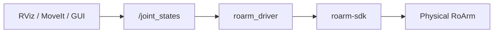

# Hardware Driver

This chapter covers **`roarm_driver`**: connecting the physical RoArm over serial and sending commands from ROS2.

For the robot model, joint names, and RViz sliders, see [Robot Description](description.md).  
For ROS2 terms (nodes, topics), see [ROS2 Basics](ros2_basics.md).

## Prerequisites

1. **Build and source** **`roarm_ws`** ([Installation](installation.md)).
2. Set **`ROARM_MODEL`** and **`GRIPPER_TYPE`** to match your hardware — see [Environment variables](installation.md#environment-variables). (`GRIPPER_TYPE` selects the roarm_m2 gripper mesh; on roarm_m3 either value is fine but must be set.)
3. **Arm powered on** and connected to the host over USB (**middle Type-C** on the driver board).
4. **Close any other RViz session** — for example `display.launch.py` from a previous test. In that terminal, press **`Ctrl+C`** (you will launch **`display.launch.py` again** in [Pub Joint State](#pub-joint-state) below).

## Overview

`roarm_driver` is the bridge between ROS2 and the arm’s ESP32 firmware (via **`roarm-sdk`**).

| Direction | Topic / input | Action |
|-----------|---------------|--------|
| ROS → arm | `/joint_states` (`sensor_msgs/JointState`) | Joint angles sent over serial |
| ROS → arm | `/led_ctrl` (`std_msgs/Float32`) | Gripper LED brightness |
| Config | `serial_port` node parameters | Serial device path |
| Config | `ROARM_MODEL` environment variable | roarm_m2 / roarm_m3 joint mapping |

## Data Transfer Process



Most tutorials keep **`roarm_driver` running in one terminal** and start MoveIt, RViz, or vision nodes in others.

!!! warning "Safety"
    Any node that publishes `joint_states` can move the real arm. Clear the area around the arm, keep hands away from pinch points, and start with small motions.

---

## Hardware Connection

### USB port on the arm

Use the **middle Type-C port** on the main PCB `General Driver for Robots`.

| Port | Purpose |
|------|---------|
| Middle Type-C | ESP32 serial communication (use this) |
| Edge Type-C | Lidar — **not** used by `roarm_driver` |

### Serial device on your computer

Before plugging in the arm:

```bash
ls /dev/tty*
```

Connect USB, then list again. 

```bash
ls /dev/tty*
```

A new device should appear, for example:

| Host | Typical device | When |
|------|----------------|------|
| PC / laptop (USB–serial chip) | `/dev/ttyUSB0` | CP210x adapter |

Use the path that appears on your system.

**VirtualBox:** attach the **CP210x** device to the VM (`Devices → USB`), enable USB 3.0 (xHCI), and add a USB filter for the adapter.

---

## Joint State Control

For **joint sliders**, launch **`display.launch.py` first**, then start the driver ([Run the Driver](#run-the-driver)). With only display running, sliders move the RViz model — the real arm stays still until **`roarm_driver`** is running.

### Pub Joint State

For example, move the robotic arm with Joint Sliders.

```bash
ros2 launch roarm_description display.launch.py use_rviz:=true
```

If the program no longer needs to run, please use **`Ctrl+C`** to close the running session.

This launches:

1. **Joint State Publisher GUI** — joint sliders  
2. **RViz** — 3D model follows the sliders (synced with the real arm after you start **`roarm_driver`** below)  

Slider names, demo videos, and RViz controls are documented in [RViz Visualization](description.md#rviz-visualization).

---

### Run the Driver

Open a **dedicated terminal** (do not use the same shell as `colcon build`).

**When to start:** after **`display.launch.py`** is running, set sliders to a **safe pose** and clear the area around the arm — **then** start the driver below. The moment **`roarm_driver` starts**, it sends the current `/joint_states` to the motors; **do not use Randomize** on the sliders until the arm is clear. For **MoveIt / Servo / Cmd / Vision**, start the driver first (Terminal 0), then the other launch — see [Typical paths](index.md#typical-paths). Before **MoveIt**, stop **`display.launch.py`** so only one source publishes `/joint_states` — see [MoveIt2 — Prerequisites](moveit2.md#prerequisites).

#### Step 1 — Serial permissions

```bash
sudo chmod 666 /dev/ttyUSB0
```

Replace `/dev/ttyUSB0` with your port.

#### Step 2 — Start the node

**`install/setup.bash`** sourced; sliders at a safe pose.

```bash
ros2 run roarm_driver roarm_driver --ros-args -p serial_port:=/dev/ttyUSB0
```

If the program no longer needs to run, please use **`Ctrl+C`** to close the running session.

Leave this terminal open. You should see no repeated error messages; the node waits for `joint_states`.

#### Step 3 — Verify the driver

1. **Quick check:** move one slider **`slowly`** — the RViz model and the physical arm should move together.

2. In a **second terminal** (**`install/setup.bash`** sourced), confirm the driver is subscribed:

```bash
ros2 topic info /joint_states --verbose
```

Under **Subscription**, you should see **`/roarm_driver`**. With **`display.launch.py`** running, **Publisher** should list **`/joint_state_publisher_gui`** (or **`/joint_state_publisher`** if `gui:=false`).

## Gripper LED Control

**`Please ensure that the node being driven is running in the background, or restart it.`**

[Run the Driver](driver_control.md#run-the-driver), publish a brightness value on `/led_ctrl`:

```bash
ros2 topic pub /led_ctrl std_msgs/msg/Float32 "{data: 128.0}" -1
```

| Field | Range | Meaning |
|-------|-------|---------|
| `data` | `0` – `255` | LED brightness (`0` = off) |

The driver must be running. `-1` publishes once and exits.

---

## Troubleshooting

| Symptom | Likely cause | What to try |
|---------|--------------|-------------|
| `Permission denied` on serial | Device not readable | `sudo chmod 666 /dev/ttyUSB0` |
| No `/dev/ttyUSB*` after plug-in | Cable, port, or VM USB passthrough | Try middle Type-C; reattach USB in VirtualBox |
| Driver runs but arm does not move | Nothing publishing `joint_states` | Launch `display.launch.py` or MoveIt |
| Arm moves in wrong direction / wrong joints | Wrong `ROARM_MODEL` | `echo $ROARM_MODEL` — must match hardware |
| `KeyError: 'ROARM_MODEL'` / node exits | Environment not set | `export ROARM_MODEL=roarm_m2` and re-source **`roarm_ws`** |
| `SerialException` in driver log | Port busy or unplugged | Close other serial tools; re-plug USB; restart driver |
| Only RViz moves, not real arm | Driver not running or wrong port | Check `ros2 node list` and `serial_port` argument |

---

## Related Tutorials

| Goal | Next page |
|------|-----------|
| Understand links, joints, TF | [Robot Description](description.md) |
| Drag end-effector with MoveIt | [MoveIt2](moveit2.md) |
| Keyboard teleoperation | [Keyboard Control](keyboard_control.md) |
| Motion via ROS services | [Command Control](command_control.md) |
| Camera pick & place | [Vision](vision.md) |
