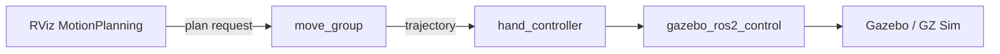

# Gazebo Simulation

**`roarm_gazebo`** runs RoArm in **Gazebo Classic** or **GZ Harmonic**, optional RViz, and an optional **MoveIt2** stack — so you can test planning and trajectories **without** `roarm_driver` or a physical arm.

For the URDF and joint names, see [Robot Description](description.md).  
For drag-and-plan basics (MotionPlanning tab, `hand_tcp`), see [MoveIt2](moveit2.md).  
For serial and the real arm, see [Hardware Driver](driver_control.md).

---

## Prerequisites

Before launching Gazebo:

1. **Build and source** **`roarm_ws`** ([Installation](installation.md)) — include **`roarm_gazebo`** (selected in `build_first.sh` when you install Gazebo).
2. Set **`ROARM_MODEL`** and **`GRIPPER_TYPE`** to match your hardware — see [Environment variables](installation.md#environment-variables). (`GRIPPER_TYPE` selects the roarm_m2 gripper mesh; on roarm_m3 either value is fine but must be set.) **`bringup_gazebo.launch.py` reads them from the environment** — if either is unset, launch fails with **`KeyError`**.
3. Set **`GZ_VERSION`** to the backend you installed — **`classic`** or **`harmonic`** only ([Installation — Gazebo](installation.md#gazebo-installation-optional)). If you skipped Gazebo in `build_first.sh`, **`GZ_VERSION` is empty** and simulation launch will not work until you install Gazebo and export a valid value.
4. **Do not start `roarm_driver`** for pure simulation — there is no serial device in Gazebo.
5. **Close any other launch** — for example `display.launch.py` ([Robot Description](description.md)), MoveIt, Servo, Cmd ([Command Control](command_control.md)), Vision ([Vision](vision.md)), MTC ([MTC Demo](mtc_demo.md)), or another Gazebo session. Press **`Ctrl+C`** in those terminals.

!!! note "Simulation vs hardware"
    Gazebo uses **`use_sim_time:=true`** and **`gazebo_ros2_control`** plugins in URDF. Controllers talk to the simulator, not ESP32. Switching back to the real arm means stopping Gazebo and starting **`roarm_driver`** again.

---

## MoveIt2 on hardware vs in Gazebo

Both use the same MoveIt config (`hand` group, **`hand_tcp`**, IKFast). The difference is **where trajectories go**.

| | **MoveIt2 on hardware** ([MoveIt2](moveit2.md)) | **MoveIt2 in Gazebo** (this page) |
|---|-----|-----|
| **Launch** | `roarm_moveit roarm_moveit.launch.py` + **`roarm_driver`** | `roarm_gazebo moveit_gazebo.launch.py` |
| **Purpose** | Plan and run on the **physical** arm | Plan and run on a **simulated** arm |
| **Input** | Drag **`hand_tcp`** in RViz → **Plan & Execute** | Drag **`hand_tcp`** in RViz → **Plan & Execute** |
| **Motion style** | One planned trajectory per goal | One planned trajectory per goal |
| **Target** | **`hand_tcp`** (MoveIt planning frame) | **`hand_tcp`** (MoveIt planning frame)  |
| **Planning** | `move_group` + IKFast | `move_group` + IKFast |
| **RViz** | `interact.rviz` | `interact.rviz` |
| **Gripper** | Planning group **`gripper`** | Planning group **`gripper`** |
| **Moves real arm?** | **Yes** — after **Plan & Execute** (via `roarm_driver`) | **No** — Gazebo model only |
| **Typical use** | Production motions, teaching points on hardware | Try poses and paths before touching the real arm |

---

## Gazebo Backend (`GZ_VERSION`)

| `GZ_VERSION` | Simulator | Install choice in `build_first.sh` |
|--------------|-----------|-------------------------------------|
| `classic` | Gazebo Classic (`gazebo11`) | **[1] Gazebo Classic** |
| `harmonic` | GZ Sim (Harmonic) | **[2] Gazebo Harmonic** |

Verify before launch (all three must print non-empty values in the terminal you use for `ros2 launch`):

```bash
echo $ROARM_MODEL $GRIPPER_TYPE $GZ_VERSION
```

`bringup_gazebo.launch.py` reads **`GZ_VERSION`** from the environment and starts the matching stack (Classic: `gazebo_ros` spawn; Harmonic: `ros_gz_sim` + `ros_gz_bridge`). Only **`classic`** and **`harmonic`** are supported — a typo, empty value, or any other string skips both simulator branches. You may still see `robot_state_publisher`, RViz, and controller spawners, but **no Gazebo window and no robot in the world** until you fix `GZ_VERSION` and relaunch.

---

## Launch Gazebo Simulation

### Bringup — simulator + RViz (no MoveIt)

Starts Gazebo (`roarm.world`), spawns the arm, loads **`ros2_control`** controllers, and optionally RViz.

```bash
ros2 launch roarm_gazebo bringup_gazebo.launch.py use_rviz:=true
```

If the program no longer needs to run, use **`Ctrl+C`** to close the session.

For drag-and-plan, use **MoveIt + Gazebo** below instead.

Optional simulated cameras:

```bash
ros2 launch roarm_gazebo bringup_gazebo.launch.py use_rviz:=true \
  rviz_config:=roarm_description add_camera:=true
```

Depth camera (**`ROARM_MODEL=roarm_m3` only**):

```bash
ros2 launch roarm_gazebo bringup_gazebo.launch.py use_rviz:=true \
  rviz_config:=roarm_description add_depth_camera:=true
```

### MoveIt2 with Gazebo (drag-and-plan in sim)

Starts **`move_group`** plus the full Gazebo bringup with MoveIt RViz config.

```bash
ros2 launch roarm_gazebo moveit_gazebo.launch.py use_rviz:=true
```

If the program no longer needs to run, use **`Ctrl+C`** to close the session.

Workflow matches [MoveIt2 — RViz MotionPlanning Walkthrough](moveit2.md#rviz-motionplanning-walkthrough): drag **`hand_tcp`**, **Plan**, **Execute** or **Plan & Execute**. Motion appears in **Gazebo** and RViz; nothing is sent over serial.

### Launch Nodes

**`bringup_gazebo.launch.py`**

| Node / process | Role |
|----------------|------|
| Gazebo / GZ Sim | Physics world **`roarm.world`**, table model, robot spawn (`z ≈ 0.903`) |
| `gazebo_ros2_control` (in URDF) | Simulated hardware interface + `controller_manager` |
| `robot_state_publisher` | URDF + `/joint_states` → TF (`use_sim_time`) |
| `spawner` nodes | `joint_state_broadcaster`, `hand_controller`, `gripper_controller` |
| `ros_gz_bridge` | Harmonic only — bridges `/clock`, `/tf`, and camera topics (not `/joint_states`) |
| `rviz2` | Selected by **`rviz_config`** (when `use_rviz:=true`) |

**`moveit_gazebo.launch.py`** adds:

| Node / process | Role |
|----------------|------|
| `move_group` | Same planning stack as [MoveIt2](moveit2.md), with `use_sim_time` |

`moveit_gazebo.launch.py` includes `bringup_gazebo.launch.py` with **`rviz_config:=roarm_moveit`**.

**Data transfer process**



On Harmonic, **`ros_gz_bridge`** forwards `/clock`, `/tf`, and cameras. **`/joint_states`** come from **`joint_state_broadcaster`** (ros2_control), not the bridge.

Camera bridge mapping (Harmonic):

| ROS topic | GZ topic |
|-----------|----------|
| `/image_raw`, `/camera_info` | `/cam/image`, `/cam/camera_info` |
| `/oak/image_raw`, `/oak/camera_info`, `/oak/depth/image_raw` | `/hand_oak/image`, `/hand_oak/camera_info`, `/hand_oak/depth_image` |

### Launch arguments (`bringup_gazebo.launch.py`)

| Argument | Default | Values / notes |
|----------|---------|----------------|
| `use_rviz` | `false` | `true` — open RViz |
| `rviz_config` | `roarm_description` | `roarm_description`, `roarm_moveit`, `roarm_moveit_servo` (`servo_control.rviz`), `roarm_moveit_mtc_demo` |
| `add_camera` | `false` | `true` — mount simulated color camera in URDF (`camera_link`) |
| `add_depth_camera` | `false` | `true` — mount simulated depth camera (**roarm_m3 only**; roarm_m2 keeps the arg but does not mount) |

---

## Troubleshooting

| Problem | What to try |
|---------|-------------|
| `KeyError: 'ROARM_MODEL'` or `'GRIPPER_TYPE'` | Export both before launch — see [Environment variables](installation.md#environment-variables) |
| `KeyError: 'GZ_VERSION'` or empty after `echo` | You skipped Gazebo in install, or the shell was not sourced — re-run [Installation — Gazebo](installation.md#gazebo-installation-optional) or `export GZ_VERSION=classic` / `harmonic` |
| `GZ_VERSION` typo / unsupported value | Must be exactly **`classic`** or **`harmonic`** — wrong values start ROS nodes without a simulator; fix and relaunch |
| Gazebo empty / no robot | Wait for spawn; check Terminal for `spawn_entity` / `create` errors; confirm `ROARM_MODEL` and valid **`GZ_VERSION`** |
| Controllers fail to load | Ensure **`roarm_ws`** is built with `gazebo_ros2_control`; only one Gazebo instance running |
| RViz model missing | **Fixed Frame** → `world`; for MoveIt path, confirm `use_rviz:=true` |
| Planning works, nothing moves in Gazebo | Controllers not spawned — read launch log for `spawner` errors |
| Real arm twitches while sim is running | Stop **`roarm_driver`** — you should not run driver and Gazebo together |
| Harmonic: no `/joint_states` | Confirm `joint_state_broadcaster` spawned; check controller_manager logs — joint states are **not** bridged from GZ |
| Wrong gripper mesh (roarm_m2) | Set **`GRIPPER_TYPE`** and relaunch — see [Robot Description](description.md) |

---

## Related Tutorials

| Chapter | What it adds |
|---------|----------------|
| [Installation](installation.md) | Build, `GZ_VERSION`, model env vars |
| [MoveIt2](moveit2.md) | Drag-and-plan on hardware |
| [Robot Description](description.md) | URDF, meshes, optional cameras |
| [Hardware Driver](driver_control.md) | Real serial bridge |
| [MTC Demo](mtc_demo.md) | MTC on hardware (not wired in sim by default) |

When switching from simulation to the real arm: **`Ctrl+C`** Gazebo, then start **`roarm_driver`** and the tutorial launch for [MoveIt2](moveit2.md), [Command Control](command_control.md), or others.
