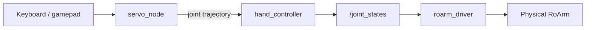

# Keyboard & Gamepad Control

Real-time jogging via **MoveIt Servo** — gamepad on **T1** (`servo_control.launch.py`), or keyboard in **T2** (`keyboardcontrol`). See [Launch MoveIt Servo](#launch-moveit-servo) for terminal order.

---

## Prerequisites

Before launching MoveIt Servo:

1. **Build and source** **`roarm_ws`** ([Installation](installation.md)).
2. Set **`ROARM_MODEL`** and **`GRIPPER_TYPE`** to match your hardware — see [Environment variables](installation.md#environment-variables). (`GRIPPER_TYPE` selects the roarm_m2 gripper mesh; on roarm_m3 either value is fine but must be set.)
3. **Close any other RViz session** — for example `display.launch.py` ([Robot Description](description.md)) or `roarm_moveit.launch.py` ([MoveIt2](moveit2.md)). In that terminal, press **`Ctrl+C`**.
4. [**Start `roarm_driver`**](driver_control.md#run-the-driver) in **Terminal 0** and leave it running.

!!! warning "Safety"
    With **`roarm_driver` running**, the real arm moves when you launch Servo (**`initial_positions.yaml`**), when you jog (keyboard or gamepad), and when you press gripper keys. Clear the area around the arm and keep hands away from pinch points **before** launching and before jogging.

---

## MoveIt vs MoveIt Servo

Both stacks use the same URDF and `/joint_states` , but the workflow is different.

| | **MoveIt2** ([tutorial](moveit2.md)) | **MoveIt Servo** (this page) |
|---|-----|-----|
| **Launch** | `roarm_moveit roarm_moveit.launch.py` | `roarm_moveit_servo servo_control.launch.py` |
| **Purpose** | Plan a path to a **target pose** | **Jog** the arm in real time (teleop) |
| **Input** | Drag `hand_tcp` in RViz → **Plan & Execute** | Keyboard (`keyboardcontrol`) or gamepad (`joy_node`) |
| **Motion style** | One planned trajectory per goal | Small trajectory streams while you hold keys / sticks |
| **Target** | **Absolute** pose — drag **`hand_tcp`** in **`base_link`** (RViz) | **Incremental** jog in **`base_link`** or **`hand_tcp`** (keyboard / gamepad) |
| **Planning** | `move_group` + IKFast; optional collision-aware paths | Servo node: per-step IK, singularity / limit checks |
| **RViz** | `interact.rviz` — MotionPlanning plugin | Servo RViz config from `servo_control.launch.py` |
| **Gripper** | Planning group **`gripper`** in MotionPlanning tab | **`g`** (keyboard) or **A** / **B** (gamepad) |
| **Moves real arm?** | After **Plan** or **Plan & Execute**  (still through `roarm_driver`) | **Immediately** while jogging (still through `roarm_driver`) |
| **Typical use** | Reach a pose, smooth approach, repeatable motions | Manual tuning, demos, fine adjustment, “fly the arm” |

**Data path (both on hardware):** input → MoveIt or Servo → `ros2_control` (`hand_controller`) → **`/joint_states`** → **`roarm_driver`** → ESP32.

---

## Launch MoveIt Servo

| Terminal | What to run |
|----------|-------------|
| **T0** | [`roarm_driver`](driver_control.md#run-the-driver) — already running from [Prerequisites](#prerequisites) |
| **T1** | `ros2 launch roarm_moveit_servo servo_control.launch.py use_rviz:=true` — **gamepad** is active here (`joy_node` starts with this launch) |
| **T2** | `ros2 run roarm_moveit_servo keyboardcontrol` — **keyboard only** ([Keyboard Control](#keyboard-control) below) |

In **Terminal 1** (**`install/setup.bash`** sourced). **Clear the area around the arm** before launch.

```bash
ros2 launch roarm_moveit_servo servo_control.launch.py use_rviz:=true
```

If the program no longer needs to run, use **`Ctrl+C`** to close the session.

Right after launch, the arm often **moves to `initial_positions.yaml`** on its own (for example roarm_m2 `link2_to_link3: 2.618`). **`roarm_driver` forwards that to the motors** — expect this motion; do not block the arm.

### Launch Nodes

| Node / process | Role |
|----------------|------|
| `robot_state_publisher` | URDF + `/joint_states` → TF |
| `move_group` | Planning scene monitor |
| `ros2_control_node` + controllers | Runs `hand_controller` and `gripper_controller`; bridges plans to joint commands |
| `joint_state_broadcaster` | Publishes `/joint_states` from the mock hardware interface |
| `servo_node` (`moveit_servo`) | Real-time IK; streams trajectories to `hand_controller` |
| `controller_to_servo_node` | Reads **`/joy`**, publishes twist/joint jog commands to `servo_node` |
| `joy_node` | Gamepad → **`/joy`** |
| `setgrippercmd` | Bridges **`/gripper_cmd`** to the gripper controller |
| `rviz2` | **`servo_control.rviz`** (when `use_rviz:=true`) |

**Data transfer process**



As with MoveIt2, `ros2_control` uses **`mock_components/GenericSystem`** on the real arm — Servo does not talk to serial directly. Trajectories update **`/joint_states`**, and **`roarm_driver`** forwards them to the ESP32.

---

## Cartesian jog axes

In **twist** mode (**`t`** on keyboard, or hold **R1** on gamepad), stick / key motions move the end effector along the **X / Y / Z** axes of the **current planning frame** — not “screen left/right” in RViz.

| Frame switch | Planning frame | What ±X / ±Y / ±Z mean |
|--------------|----------------|-------------------------|
| **`w`** / gamepad **X** | **`base_link`** | Fixed to the robot base: **+X = forward**, **+Y = left**, **+Z = up** ([right-hand rule](roarm_basics.md#base_link-axes-right-hand-rule)) |
| **`e`** / gamepad **Y** | **`hand_tcp`** | Axes **move with the tool** — +X/±Y/±Z follow the gripper orientation, not the desk |

Read **`base_link`** directions once in [RoArm Basics — `base_link` axes](roarm_basics.md#base_link-axes-right-hand-rule) before jogging. In **`hand_tcp`** mode, press **`e`** / **Y** only when you intend to jog relative to the gripper.

**Joint jog** (**`j`** / release **R1**) uses joint names (`1`…`5`, sticks mapped to joints) — no Cartesian X/Y/Z.

---

## Gamepad Control

The RoArm kit does **`not`** include a gamepad. Use an **Xbox 360–compatible** controller (USB) or a **SHANWAN Android Gamepad**.

After `servo_control.launch.py` is running, connect or pair the controller — **no extra terminal command** is needed. The launch file already starts `joy_node` and `controller_to_servo_node` (reads `/joy`, sends servo commands).

On the **first** joystick message, the current stick positions are stored as zero — release the sticks, then start moving.

**Click an image for full-screen view** — click outside, press **Esc**, or **×** to close.


### Mode Switch

| Control | Mode |
|---------|------|
| **R1 held** | Cartesian **twist** (end-effector jog) |
| **R1 released** | **Joint jog** |

### Frame Switch (twist mode)

| Button | Action |
|--------|--------|
| **X** | Planning frame → `base_link` |
| **Y** | Planning frame → `hand_tcp` |

### Gripper (all models)

| Button | Action |
|--------|--------|
| **A** | Close gripper (step down, min `0`) |
| **B** | Open gripper (step up, max `1.5`) |

### roarm_m2

**Coordinate control** (hold **R1**)

| Control | Action |
|---------|--------|
| Left stick Y / X | ±X / ±Y |
| Left stick press | ±Z — direction set by **R2** |

**Joint control** (release **R1**)

| Control | Joint |
|---------|--------|
| Left stick X | Base (`base_link_to_link1`) |
| Left stick Y | Shoulder (`link1_to_link2`) |
| Left stick press | Elbow (`link2_to_link3`) — direction set by **R2** |

### roarm_m3

**Coordinate control** (hold **R1**)

| Control | Action |
|---------|--------|
| Left stick Y / X | ±X / ±Y |
| Right stick X / Y | Roll / ±Pitch |
| Left stick press | ±Z — direction set by **R2** |

**Joint control** (release **R1**)

| Control | Joint |
|---------|--------|
| Left stick X | Base (`base_link_to_link1`) |
| Left stick Y | Shoulder (`link1_to_link2`) |
| Left stick press | Elbow (`link2_to_link3`) — direction set by **R2** |
| Right stick Y | Wrist (`link3_to_link4`) |
| Right stick X | Roll (`link4_to_link5`) |

### Supported controllers

| Name reported by SDL | Mapping |
|----------------------|---------|
| `Xbox 360 Controller` | Xbox layout (default) |
| `SHANWAN Android Gamepad` | ShanWan layout |

Other pads use the **Xbox 360** button map. If axes feel wrong, check the name printed at startup or pair a supported controller.

---

## Keyboard Control

**`If you no longer need gamepad control, please turn gamepad off to avoid control conflicts.`**

**Terminal 2** (**`install/setup.bash`** sourced):

```bash
ros2 run roarm_moveit_servo keyboardcontrol
```

If the program no longer needs to run, press **`Q`** to close the session.

Keep that terminal focused for key input.

### Mode Switch

| Key | Mode |
|-----|------|
| **`t`** | Cartesian **twist** (end-effector jog) |
| **`j`** | **Joint jog** |

Press **`t`** or **`j`** once to select the mode before jogging. Unlike the gamepad, the mode stays active until you switch again (no need to hold a key).

### Frame Switch (twist mode)

| Key | Action |
|-----|--------|
| **`w`** | Planning frame → `base_link` |
| **`e`** | Planning frame → `hand_tcp` |

### Gripper (all models)

| Key | Action |
|-----|--------|
| **`g`** | Open / close gripper (step size depends on jog direction) |
| **`s`** | Reverse jog direction (twist, joint, and gripper step) |

### roarm_m2

**Click an image for full-screen view** — click outside, press **Esc**, or **×** to close.


**Coordinate control** (press **`t`** first)

| Key | Action |
|-----|--------|
| `x` | ±X |
| `y` | ±Y |
| `z` | ±Z |

**Joint control** (press **`j`** first)

| Key | Joint |
|-----|--------|
| `1` | Base (`base_link_to_link1`) |
| `2` | Shoulder (`link1_to_link2`) |
| `3` | Elbow (`link2_to_link3`) |

#### angular_direct

<video src="https://github.com/user-attachments/assets/1588a348-b9c9-4c86-90dc-c3b6f52373a8" controls width="500"></video>

---

#### angular_gear

<video src="https://github.com/user-attachments/assets/271db50a-dbec-4bc5-8287-77a3a6420e71" controls width="500"></video>

---

### roarm_m3

**Click an image for full-screen view** — click outside, press **Esc**, or **×** to close.


**Coordinate control** (press **`t`** first)

| Key | Action |
|-----|--------|
| `x` | ±X |
| `y` | ±Y |
| `z` | ±Z |
| `r` | ±Roll |
| `p` | ±Pitch |

**Joint control** (press **`j`** first)

| Key | Joint |
|-----|--------|
| `1` | Base |
| `2` | Shoulder |
| `3` | Elbow |
| `4` | Wrist (`link3_to_link4`) |
| `5` | Roll (`link4_to_link5`) |

<video src="https://github.com/user-attachments/assets/2e0da9fe-b554-4ed9-a805-f02b0ede8d33" controls width="500"></video>

---

## Troubleshooting

| Problem | What to try |
|---------|-------------|
| `No joystick detected` at startup | Pair USB controller before launch |
| Arm drifts when sticks are centered | Release sticks at power-on; restart launch so calibration runs again |
| Both keyboard and gamepad active | Avoid — use one input at a time |
| `KeyError: 'ROARM_MODEL'` or `KeyError: 'GRIPPER_TYPE'` on launch | Set env vars: `export ROARM_MODEL=roarm_m2` (or `roarm_m3`), `export GRIPPER_TYPE=angular_direct` (or `angular_gear`); `source install/setup.bash` and relaunch |
| Arm does not move while jogging | Confirm **`roarm_driver`** is running on **T0**; check `serial_port` and `ROARM_MODEL` — [Hardware Driver](driver_control.md) |
| `display.launch.py` or MoveIt still running | Stop other launches so only Servo publishes `/joint_states` — see [Prerequisites](#prerequisites) |
| Keyboard has no effect | Focus the **T2** terminal running `keyboardcontrol`; confirm **T1** `servo_control.launch.py` is still running |
| Port already in use / stale RViz | `Ctrl+C` all old launches, then restart **T0** driver and **T1** Servo |

---

## Related Tutorials

| Chapter | What it adds |
|---------|----------------|
| [MoveIt2](moveit2.md) | Plan to a pose in RViz (vs real-time Servo jog) |
| [Command Control](command_control.md) | Pose goals via ROS services and scripts |
| [Hardware Driver](driver_control.md) | `roarm_driver` on Terminal 0 |
| [MTC Demo](mtc_demo.md) | Multi-stage pick/place tasks in MoveIt |

When switching tutorials, stop the current launch with **`Ctrl+C`**, but usually **keep `roarm_driver` running** unless the next chapter says otherwise.
