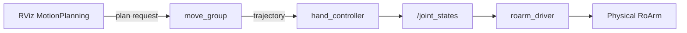

# MoveIt2

Use **MoveIt2** to plan arm motions by dragging the end effector in RViz, then execute the plan on the real robot through `roarm_driver`.

For the robot model and joint names, see [Robot Description](description.md).  
For `hand_tcp` vs real TCP, see [RoArm Basics](roarm_basics.md).  
For starting the driver and serial setup, see [Hardware Driver](driver_control.md).

---

## Prerequisites

Before launching MoveIt:

1. **Build and source** **`roarm_ws`** ([Installation](installation.md)).
2. Set **`ROARM_MODEL`** and **`GRIPPER_TYPE`** to match your hardware — see [Environment variables](installation.md#environment-variables). (`GRIPPER_TYPE` selects the roarm_m2 gripper mesh; on roarm_m3 either value is fine but must be set.)
3. **Close any other RViz session** — for example `display.launch.py` from [Robot Description](description.md). In that terminal, press **`Ctrl+C`**.
4. [**Start `roarm_driver`**](driver_control.md#run-the-driver) in **Terminal 0** and leave it running.

!!! warning "Safety"
    With **`roarm_driver` running**, the real arm can move when you launch MoveIt (**`initial_positions.yaml`**) and when you click **Plan & Execute**. Clear the area around the arm and keep hands away from pinch points **before** launching and before planning.

---

## MoveIt vs Joint State Publisher GUI

Both use the same URDF and `/joint_states`, but the workflow is different.

| | **Joint State Publisher GUI** ([tutorial](description.md)) | **MoveIt2** (this page) |
|---|-----|-----|
| **Launch** | `display.launch.py` | `roarm_moveit.launch.py` |
| **Purpose** | Inspect the model; move joints manually | Plan collision-aware paths; drag end effector (IK) |
| **Input** | Drag sliders | Drag `hand_tcp` in RViz → **Plan & Execute** |
| **Motion style** | None | One planned trajectory per goal |
| **Planning** | None | `move_group` + IKFast solver |
| **RViz** | `view_description.rviz` | `interact.rviz` (MotionPlanning plugin) |
| **Gripper** | Slider: **`gripper_joint`** (roarm_m2) / **`link5_to_gripper_link`** (roarm_m3) | Planning group **`gripper`** (same joint in SRDF) |
| **Moves real arm?** | Yes — sliders publish `/joint_states` immediately | Only after **Plan & Execute** (or **Execute** after **Plan**) |
| **Typical use** | Learn joint names, check gripper mesh | Reach poses in 3D, smooth trajectories |

---

## Launch MoveIt2

With `roarm_driver` still running, open a **second terminal** (**`install/setup.bash`** sourced). **Clear the area around the arm** — the arm may move as soon as MoveIt starts (see below).

```bash
ros2 launch roarm_moveit roarm_moveit.launch.py use_rviz:=true
```

If the program no longer needs to run, use **`Ctrl+C`** to close the session.

Right after launch, the arm often **moves to `initial_positions.yaml`** on its own (for example roarm_m2 `link2_to_link3: 2.618`). **`roarm_driver` forwards that to the motors** — expect this motion; do not block the arm.

### Launch Nodes

| Node / process | Role |
|----------------|------|
| `robot_state_publisher` | Publishes TF from the robot URDF |
| `move_group` | Motion planning, IK, trajectory execution |
| `ros2_control_node` + controllers | Runs `hand_controller` and `gripper_controller`; bridges plans to joint commands |
| `joint_state_broadcaster` | Publishes `/joint_states` from the mock hardware interface |
| `rviz2` | Loads **`interact.rviz`** with the MotionPlanning panel (when `use_rviz:=true`) |

Planning uses the **`hand`** group (base → **`hand_tcp`**). The gripper is the separate **`gripper`** group — **`gripper_joint`** on roarm_m2, **`link5_to_gripper_link`** on roarm_m3.

**Data Transfer Process**



On real hardware, `ros2_control` uses **`mock_components/GenericSystem`** — it does not talk to serial directly. Trajectories update `/joint_states`, and **`roarm_driver`** forwards those angles to the arm.

---

### RViz MotionPlanning Walkthrough

The launch file opens RViz with the MotionPlanning display when `use_rviz:=true`. If the model is missing, see [Troubleshooting](#troubleshooting) below.

#### Step 1 — Drag the end effector

Use the **interactive marker** at **`hand_tcp`** (sphere and RGB axes):

- Drag the sphere or axes to a new pose.
- The orange robot in RViz updates; the **physical arm does not move yet**.

This step runs inverse kinematics inside MoveIt.

#### Step 2 — Plan and execute

In the **Planning** tab (right side):

| Button | Effect |
|--------|--------|
| **Plan** | Compute a path; preview in RViz only |
| **Execute** | Run the last successful plan on the real arm |
| **Plan & Execute** | Plan, then execute if planning succeeds |

Use **Plan & Execute** for normal operation.

#### Step 3 — Control the gripper

Switch **Planning Group** from **`hand`** to **`gripper`**, then plan/execute open or close.  
Select the gripper marker as shown:

**Click an image for full-screen view** — click outside, press **Esc**, or **×** to close.


Predefined poses (**home**, **ready**, **open**, **close**) are in `roarm_moveit/config/<ROARM_MODEL>/*.srdf`.

---

### Demo Videos

#### roarm_m2 

##### angular_direct

<video src="https://github.com/user-attachments/assets/a601d7e8-fb74-4fd7-b8a6-ca70374e0a89" controls width="500"></video>

---

##### angular_gear

<video src="https://github.com/user-attachments/assets/c5e38ad0-0873-49b7-b65b-4b23dbdea00a" controls width="500"></video>

---

#### roarm_m3

<video src="https://github.com/user-attachments/assets/4bbabc67-d316-402a-ad07-dd766d545ac1" controls width="500"></video>

---

## Troubleshooting

| Problem | What to try |
|---------|-------------|
| No robot in RViz | **Fixed Frame** → `world`; add **MotionPlanning** display |
| Planning fails | Target out of reach or near singularity; drag closer, change orientation |
| Arm does not move on Execute | Confirm `roarm_driver` is running; check serial port and `ROARM_MODEL` |
| `KeyError: 'ROARM_MODEL'` or `KeyError: 'GRIPPER_TYPE'` on launch | Set env vars: `export ROARM_MODEL=roarm_m2` (or `roarm_m3`), `export GRIPPER_TYPE=angular_direct` (or `angular_gear`); `source install/setup.bash` and relaunch |
| Wrong gripper mesh (roarm_m2) | Set `GRIPPER_TYPE` (`angular_direct` / `angular_gear`) and relaunch — see [Robot Description](description.md) |
| `display.launch.py` still running | Only one publisher should drive the arm — stop display, then restart driver and MoveIt — see [Prerequisites](#prerequisites) |
| Port already in use / stale RViz | `Ctrl+C` all old launches, then restart driver and MoveIt |

---

## Related Tutorials

| Chapter | What it adds |
|---------|----------------|
| [Keyboard & Gamepad Control](keyboard_control.md) | Real-time jog via MoveIt Servo — keyboard or gamepad (keep driver running) |
| [Command Control](command_control.md) | Pose/joint goals through ROS2 services |
| [MTC Demo](mtc_demo.md) | MoveIt Task Constructor pick/place-style demos |
| [Gazebo](gazebo.md) | Same MoveIt stack against simulated physics |

When switching tutorials, stop the current launch with **`Ctrl+C`**, but usually **keep `roarm_driver` running** unless the next chapter says otherwise.
