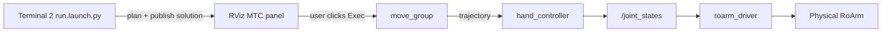

# MoveIt Task Constructor (MTC) Demo

**MoveIt Task Constructor (MTC)** chains several motion **stages** (move to pose, Cartesian step, connect, gripper open/close) into one task. This package ships ready-made tasks for RoArm; you inspect the plan in RViz, then execute on the **real arm**.

For MoveIt basics, see [MoveIt2](moveit2.md).  
For frames and `hand_tcp`, see [RoArm Basics](roarm_basics.md).

---

## Prerequisites

Before launching MoveIt Task Constructor:

1. **Build and source** **`roarm_ws`** ([Installation](installation.md)).
2. Set **`ROARM_MODEL`** and **`GRIPPER_TYPE`** to match your hardware — see [Environment variables](installation.md#environment-variables). (`GRIPPER_TYPE` selects the roarm_m2 gripper mesh; on roarm_m3 either value is fine but must be set.)
3. **Close any other RViz session** — for example `display.launch.py` ([Robot Description](description.md)), `roarm_moveit.launch.py` ([MoveIt2](moveit2.md)), `servo_control.launch.py` ([Keyboard Control](keyboard_control.md)), or `command_control.launch.py` ([Command Control](command_control.md)). In that terminal, press **`Ctrl+C`**.
4. [**Start `roarm_driver`**](driver_control.md#run-the-driver) in **Terminal 0** and leave it running.

!!! warning "Safety"
    With **`roarm_driver` running**, the real arm can move when you launch MTC (**`initial_positions.yaml`**) and when you click **`Exec`** in RViz. Clear the area around the arm and keep hands away from pinch points **before** launching and before executing.

---

## MoveIt Cmd vs MoveIt Task Constructor

Both stacks share the same URDF, **`roarm_driver`**, and **`/joint_states`** path on hardware. Run **one stack at a time** — close the other launches listed in [Prerequisites](#prerequisites) before MTC (and close MTC before switching to Cmd, Servo, display, or drag-and-plan MoveIt).

| | **MoveIt Cmd** ([Command Control](command_control.md)) | **MoveIt Task Constructor** (this page) |
|---|-----|-----|
| **Launch** | `roarm_moveit_cmd command_control.launch.py` | `roarm_moveit_mtc_demo demo.launch.py` **+** `run.launch.py exe:=…` |
| **Purpose** | **Discrete goals** — move to a pose or path from CLI or code | **Multi-stage tasks** — chain moves, Cartesian steps, gripper, pick/place demos |
| **Input** | `ros2 service call …` and `ros2 topic pub /gripper_cmd …` | Run a task **executable** (`exe:=cartesian`, `pick_place`, …); **`Exec`** in RViz |
| **Motion style** | **One plan + execute** per service call, then stop | **One task** = many planned stages; inspect full solution, then execute |
| **Target** | **Absolute** x/y/z (and roll/pitch/yaw on M3) in **`base_link`** via the analytical solver | Stages in MoveIt frames (`world`, **`hand_tcp`**, group **`hand`**) |
| **Planning** | `roarmserver` → solver IK → **`move_group`** plan & execute | MTC stage tree → **`move_group`** plans each stage → merged solution |
| **RViz** | `command_control.rviz` (MoveIt stack; optional visualization) | `mtc.rviz` — **MoveIt Task Constructor** panel (stage tree + solution) |
| **Gripper** | **`gripper`** field in motion services (see [Command Control](command_control.md)); **`/gripper_cmd`** for jaw-only moves | Open/close as MTC **stages** inside a task (e.g. `pick_place`) |
| **Moves real arm?** | **Immediately** when service call succeeds (still through `roarm_driver`) | After you click **`Exec`** in RViz (still through `roarm_driver`) |
| **Typical use** | Automation, teaching points, shell scripts, integration tests | Cartesian sequences, pick → lift → place, vision-linked MTC demos |

**Data path on hardware:**

- **MoveIt Cmd:** `roarmserver` → **`move_group`** → `hand_controller` → **`/joint_states`** → **`roarm_driver`** → ESP32.
- **MTC:** T2 task executable (plan) → RViz **`Exec`** → **`move_group`** → `hand_controller` → **`/joint_states`** → **`roarm_driver`** → ESP32.

---

## Launch MoveIt Task Constructor

On hardware, MTC uses **three terminals**: **`roarm_driver`** (from [Prerequisites](#prerequisites)) plus the two launches below. **Planning and execution are separate** — Terminal 2 only plans; the real arm moves after you click **`Exec`** in RViz.

| Terminal | Command | Keep open? |
|----------|---------|------------|
| **T0** | `roarm_driver` ([driver](driver_control.md#run-the-driver)) | Yes — entire session |
| **T1** | `demo.launch.py` | Yes — switch demos without restarting |
| **T2** | `run.launch.py exe:=…` | Re-launch when you change `exe:=` |

### Terminal 1 — MoveIt + MTC RViz

With **`roarm_driver`** still running, open a **second terminal** (**`install/setup.bash`** sourced):

```bash
ros2 launch roarm_moveit_mtc_demo demo.launch.py use_rviz:=true
```

If the program no longer needs to run, use **`Ctrl+C`** to close the session.

Right after launch, the arm often **moves to `initial_positions.yaml`** on its own (for example roarm_m2 `link2_to_link3: 2.618`). **`roarm_driver` forwards that to the motors** — expect this motion; do not block the arm.

### Terminal 2 — Plan a task

Open a **third terminal** (**`install/setup.bash`** sourced). Pick an `exe:=` value from [Available demos](#available-demos) below, then:

```bash
ros2 launch roarm_moveit_mtc_demo run.launch.py exe:=cartesian
```

Replace `cartesian` with `cartesian_modular`, `pick_place`, or another binary from the table.

Wait until Terminal 2 prints that planning succeeded (or the MTC panel shows a valid solution). Then click **`Exec`** in RViz.

**Click an image for full-screen view** — click outside, press **Esc**, or **×** to close.


To run a **different** demo: **`Ctrl+C`** Terminal 2 only, launch another `exe:=…`. Terminal 1 can stay open.

### Launch Nodes

| Node / process | Role | Started by |
|----------------|------|------------|
| `robot_state_publisher` | URDF + `/joint_states` → TF | T1 `demo.launch.py` |
| `move_group` | Motion planning + **`ExecuteTaskSolutionCapability`** (MTC execute) | T1 |
| `ros2_control_node` + controllers | `hand_controller`, `gripper_controller`, `joint_state_broadcaster` | T1 |
| `rviz2` | **`mtc.rviz`** — MoveIt Task Constructor panel (when `use_rviz:=true`) | T1 |
| `cartesian`, `pick_place`, … | Builds MTC stage tree, plans, publishes solution to introspection | T2 `run.launch.py` |

T1 includes `roarm_moveit.launch.py` with `rviz_config:=roarm_moveit_mtc_demo` — same `move_group` / `ros2_control` stack as [MoveIt2](moveit2.md), plus the MTC execute capability.

**Data Transfer Process**



| Step | What happens |
|------|----------------|
| 1 | **`demo.launch.py`** (T1) starts `move_group` with MTC support, RViz (`mtc.rviz`), and `ros2_control`. |
| 2 | **`run.launch.py exe:=…`** (T2) runs a task **executable**. It builds the stage list, **plans** once, and publishes the solution to the MTC introspection display. |
| 3 | In RViz, open the **MoveIt Task Constructor** panel — you should see the stage tree and a valid solution path. |
| 4 | Select the solution (if several are listed), then click **`Exec`**. |
| 5 | `move_group` runs **`ExecuteTaskSolutionCapability`** → trajectories → `/joint_states` → **`roarm_driver`**. |

**`cartesian`** and **`cartesian_modular`** only plan and publish the solution to RViz — they never execute on their own. **`pick_place`** behaves the same by default (`pick_place_task_demo.execute: false` in `pick_place_parameters.yaml`). Click **`Exec`** in RViz to move the arm unless you enable auto-execute for `pick_place` (see [Troubleshooting](#troubleshooting)).

On real hardware, `ros2_control` uses **`mock_components/GenericSystem`** — it does not talk to serial directly. Trajectories update `/joint_states`, and **`roarm_driver`** forwards them to the ESP32.

### Available demos

| `exe:=` | Program | What it does |
|---------|---------|----------------|
| `cartesian` | `cartesian` | From **ready** pose: +X, +Y, +Z in `world`; M3 adds +roll/+pitch twists; connect back to start |
| `cartesian_modular` | `cartesian_modular` | Same Cartesian moves packaged as reusable modules (five repeated blocks) |
| `pick_place` | `pick_place` | Virtual table + cylinder in the planning scene; pick → lift → place → retreat (gripper open/close) |

Parameters (table pose, object size, approach distances) live in `roarm_moveit_mtc_demo/config/roarm_config.yaml`.

For each demo: launch with the matching `exe:=` in Terminal 2, then **`Exec`** in RViz. Videos below were recorded per model / gripper type.

#### Cartesian

From the **ready** pose, the arm moves +X, +Y, +Z in `world` (M3 adds wrist twists), then connects back.

##### roarm_m2

###### angular_direct

<video src="https://github.com/user-attachments/assets/b7bc136d-13a3-4f0c-a604-8f0bfa62b158" controls width="500"></video>

###### angular_gear

<video src="https://github.com/user-attachments/assets/e59d5fe9-f3ba-414e-b84a-469ca3314594" controls width="500"></video>

##### roarm_m3

<video src="https://github.com/user-attachments/assets/33ebedff-de7b-4817-a351-e98c3ea24d57" controls width="500"></video>

#### Cartesian Modular

Same motion as **Cartesian**, split into reusable MTC modules (five repeated blocks).

##### roarm_m2

###### angular_direct

<video src="https://github.com/user-attachments/assets/0ea52d20-7c73-4fa0-bbbc-ff32aba37c3c" controls width="500"></video>

###### angular_gear

<video src="https://github.com/user-attachments/assets/04c53e0c-a5f3-4236-8112-d4f82434a076" controls width="500"></video>

##### roarm_m3

<video src="https://github.com/user-attachments/assets/9d776f23-8e0d-4ff8-9a80-321db88f9f5f" controls width="500"></video>

#### Pick & Place

Spawns a **virtual** table and cylinder in the MoveIt planning scene (collision-aware planning). The real desk and object are not required; arm motion is real after **`Exec`**.

##### roarm_m2

###### angular_direct

<video src="https://github.com/user-attachments/assets/90153248-ee36-48e9-a725-82e7c94c9914" controls width="500"></video>

##### angular_gear

<video src="https://github.com/user-attachments/assets/c97c1a4c-6b80-4a8a-9bdf-a2617ccf7f1e" controls width="500"></video>

##### roarm_m3

<video src="https://github.com/user-attachments/assets/4d8fdc80-6d39-49e5-8331-0f2efa6473b2" controls width="500"></video>

---

## Troubleshooting

| Problem | What to try |
|---------|-------------|
| No MTC panel / empty RViz | Confirm Terminal 1 used `demo.launch.py` (loads `mtc.rviz`); set **Fixed Frame** → `world` |
| Planning failed in Terminal 2 | Check `ROARM_MODEL`; ensure Terminal 1 `move_group` is running; read stderr for stage errors |
| Solution shown but **Exec** does nothing | Is `roarm_driver` running? Any serial errors? |
| Arm moves in RViz only | You planned but did not click **`Exec`** — execution is manual by design |
| Want auto-execute for `pick_place` | Set `pick_place_task_demo.execute: true` in params (advanced; default is `false`) |

---

## Related

| Chapter | Link |
|---------|------|
| Drag-and-plan MoveIt | [MoveIt2](moveit2.md) |
| Service-based motion | [Command Control](command_control.md) |
| Camera + real pick-place | [Vision](vision.md) |
