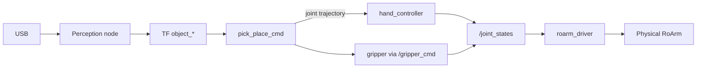

# Vision & Pick / Place

**`roarm_vision`** connects a **camera pipeline** to perception nodes (AprilTag, color block), publishes object poses on **TF**, and exposes **`/pick_place_cmd`** so the **real arm** can approach, align, grasp, and place targets.

For the analytical solver and real TCP, see [RoArm Basics](roarm_basics.md).  
For serial and `roarm_driver`, see [Hardware Driver](driver_control.md).  
For service-style motion without a camera, see [Command Control](command_control.md).

---

## Prerequisites

Before launching vision demos:

1. **Build and source** **`roarm_ws`** ([Installation](installation.md)) — include **`roarm_vision`** and Python deps (`dt-apriltags`, OpenCV).
2. Set **`ROARM_MODEL`** and **`GRIPPER_TYPE`** to match your hardware — see [Environment variables](installation.md#environment-variables). (`GRIPPER_TYPE` selects the roarm_m2 gripper mesh; on roarm_m3 either value is fine but must be set.)
3. **USB camera** connected and listed (default **`/dev/video0`** in `roarm_vision/config/params.yaml`).
4. **`camera_link`** must exist in TF (camera in URDF, or a static transform from the arm base).
5. **Close other stacks** — for example `display.launch.py` ([Robot Description](description.md)), MoveIt RViz, Servo, Cmd, MTC, or Gazebo. Press **`Ctrl+C`** in those terminals.
6. [**Start `roarm_driver`**](driver_control.md#run-the-driver) in **Terminal 0** and leave it running.

!!! warning "Safety"
    With **`roarm_driver` running**, the real arm can move when you launch the Cmd stack in T1 (**`initial_positions.yaml`**), when you call **`/pick_place_cmd`**, and when gripper commands are published. Clear the area around the arm, calibrate the camera mount, and keep hands away from pinch points **before** launching T1 and before each pick or place.

!!! note "Controllers required"
    `pick_place_cmd` publishes arm trajectories to **`/hand_controller/joint_trajectory`** and gripper commands to **`/gripper_cmd`**. That needs **`ros2_control`** (`hand_controller`, `gripper_controller`) and the **`setgrippercmd`** bridge — provided by [Command Control](command_control.md). Launch Cmd with **`use_rviz:=true`** (recommended) so you can inspect TF, the robot model, and **`object_*`** frames while debugging.

---

## Vision pick-place vs MoveIt Cmd vs MTC

All three can move the real arm; the **input** and **planner** differ.

| | **Vision pick-place** (this page) | **MoveIt Cmd** ([Command Control](command_control.md)) | **MTC + vision** ([MTC Demo](mtc_demo.md)) |
|---|-----|-----|-----|
| **Launch** | `roarm_vision demo.launch.py` + **`command_control.launch.py`** + driver | `roarm_moveit_cmd command_control.launch.py` | `roarm_moveit_mtc_demo demo.launch.py` + `run.launch.py exe:=pick_place` |
| **Purpose** | Detect object in camera → pick / place on hardware | Discrete pose / path goals from CLI | Multi-stage MTC task with vision-fed targets |
| **Input** | Camera + **`/pick_place_cmd`** service | `ros2 service call` on `/move_joint_cmd`, … | MTC executable + **`Exec`** in RViz |
| **Motion style** | Scripted pick sequence + visual servo alignment | One plan + execute per service call | Many planned stages; manual **Exec** |
| **Target** | TF frames **`object_<id>`** from perception | Solver pose in **`base_link`** | MTC stages + vision nodes |
| **Planning** | On-board solver in `pick_place_cmd` → direct joint trajectories | `roarmserver` → **`move_group`** | MTC → **`move_group`** |
| **RViz** | **`command_control.rviz`** — recommended **`use_rviz:=true`** for TF / model debugging | `command_control.rviz` | `mtc.rviz` |
| **Gripper** | **`gripper`** field in `/pick_place_cmd`; **`/gripper_cmd`** | Service field + **`/gripper_cmd`** | MTC gripper stages |
| **Moves real arm?** | **Yes** — on service call (via `hand_controller` → driver) | **Yes** — on service success | **Yes** — after **Exec** |
| **Typical use** | Tag / color demos on a bench setup | Scripting without vision | Full pick-place pipeline in MoveIt |

**Data path (vision on hardware):** camera → perception node → TF **`object_*`** → **`/pick_place_cmd`** → **`/hand_controller/joint_trajectory`** + **`/gripper_cmd`** → **`ros2_control`** → **`/joint_states`** → **`roarm_driver`** → ESP32.

---

## Launch Vision & Pick / Place

Use **three terminals** on the real arm.

| Terminal | Command | Keep open? |
|----------|---------|------------|
| **T0** | `roarm_driver` ([driver](driver_control.md#run-the-driver)) | Yes |
| **T1** | `command_control.launch.py` | Yes — provides `ros2_control` + gripper bridge |
| **T2** | `roarm_vision demo.launch.py exe:=…` | Re-launch to swap perception node |

### Terminal 1 — `ros2_control` stack

Launch [Command Control](command_control.md) with RViz so you can watch **`base_link`**, **`camera_link`**, and **`object_*`** while tuning perception and pick-place:

```bash
ros2 launch roarm_moveit_cmd command_control.launch.py use_rviz:=true add_camera:=true
```

Use **`use_rviz:=false`** only on headless boards if you do not need on-screen debugging.

If the program no longer needs to run, use **`Ctrl+C`** to close the session.

Right after launch, the arm often **moves to `initial_positions.yaml`** on its own (for example roarm_m2 `link2_to_link3: 2.618`). **`roarm_driver` forwards that to the motors** — expect this motion; do not block the arm.

Do **not** call `/move_joint_cmd` while a vision pick is running. You only need the controllers and **`setgrippercmd`** bridge from this launch.

### Terminal 2 — Camera + perception + pick/place

Pick an `exe:=` value from [Available perception nodes](#available-perception-nodes-exe) below.

**Standalone RoArm** (fixed base) — default **`base_frame`** is already `base_link`:

```bash
ros2 launch roarm_vision demo.launch.py exe:=apriltag_detect
```

**UGV + RoArm** — pass the arm root on the chassis:

```bash
ros2 launch roarm_vision demo.launch.py exe:=apriltag_detect base_frame:=ugv_roarm_base_link
```

If the program no longer needs to run, use **`Ctrl+C`** to close the session.

### Launch Nodes

| Node / process | Role | Started by |
|----------------|------|------------|
| `v4l2_camera` | USB camera → `/image_raw` | T2 `demo.launch.py` → `camera.launch.py` |
| `image_proc` (`rectify`) | `/image_raw` → `/image_rect` | T2 |
| `apriltag_detect` / `color_block_detect` | Perception; publishes TF **`object_*`** | T2 (`exe:=`) |
| `pick_place_cmd` | **`/pick_place_cmd`** service; IK + visual servo; trajectories | T2 |
| `move_group` | Idle unless you use Cmd services | T1 |
| `ros2_control_node` + controllers | `hand_controller`, `gripper_controller` | T1 |
| `setgrippercmd` | **`/gripper_cmd`** → gripper controller | T1 |
| `roarm_driver` | Serial bridge | T0 |

**Data Transfer Process**



### Launch arguments (`demo.launch.py`)

| Argument | Default | Notes |
|----------|---------|-------|
| `exe` | *(required)* | `apriltag_detect`, `color_block_detect` |
| `base_frame` | `base_link` | Arm base for object pose lookup — UGV: **`ugv_roarm_base_link`** |
| `cam_frame` | `camera_link` | Camera optical frame (must exist in TF) |
| `color` | `green` | HSV target for `color_block_detect` (`lab_tool_colors.json`) |

Camera device and resolution: `roarm_vision/config/params.yaml` (`video_device`, `image_width`, `image_height`).

---

## `/pick_place_cmd` service

```bash
ros2 service call /pick_place_cmd roarm_msgs/srv/PickPlaceCmd "{cmd: 1, target: 1, gripper: 0.5}"
```

Wait until TF shows the target frame (e.g. **`object_1`** for AprilTag ID 1) before calling pick.

| Field | Type | Meaning |
|-------|------|---------|
| `cmd` | `int32` | **`0`** = approach / align (no grasp) · **`1`** = pick · **`2`** = place |
| `target` | `int32` | Object index → TF child frame **`object_<target>`** (AprilTag: matches tag ID) |
| `gripper` | `float32` | Gripper command (radians) used on **pick** close |

**Pick then place example:**

```bash
# Pick object_1
ros2 service call /pick_place_cmd roarm_msgs/srv/PickPlaceCmd "{cmd: 1, target: 1, gripper: 0.5}"

# Place at the built-in place pose (target ignored for place)
ros2 service call /pick_place_cmd roarm_msgs/srv/PickPlaceCmd "{cmd: 2, target: 0, gripper: 0.0}"
```

Check frames:

```bash
ros2 run tf2_ros tf2_echo base_link object_1
```

Use your configured **`base_frame`** instead of `base_link` if different.

### Available perception nodes (`exe:=`)

| `exe:=` | Node | What it does |
|---------|------|----------------|
| `apriltag_detect` | AprilTag `tag36h11` | Estimates pose; TF **`object_<tag_id>`** relative to **`cam_frame`** |
| `color_block_detect` | Color blob (HSV) | Tracks colored block; default TF **`object_1`**; tune via `color:=` and `config/lab_tool_colors.json` |

Other entry points (not started by `demo.launch.py`):

| Command | Role |
|---------|------|
| `ros2 run roarm_vision color_select` | Interactive HSV tuning for color detection |

AprilTag and color nodes optionally stream annotated video over **RTSP** (`rtsp://localhost:8554/cam`) via bundled **mediamtx** + GStreamer — useful for debugging; requires GStreamer on the host.

---

### AprilTag demo

Place **tag36h11** tags in view of the camera. Launch (T2):

```bash
ros2 launch roarm_vision demo.launch.py exe:=apriltag_detect base_frame:=base_link
```

When **`object_1`** / **`object_2`** appear in TF, call **`/pick_place_cmd`** as above.

---

### Color block demo

Detects a colored region (default **`green`**). Calibrate HSV with `color_select` if tracking is poor.

```bash
ros2 launch roarm_vision demo.launch.py exe:=color_block_detect base_frame:=base_link color:=green
```

Target frame defaults to **`object_1`**. Pick with `target: 1`.

---

## Troubleshooting

| Problem | What to try |
|---------|-------------|
| No `/image_raw` | Check `video_device` in `params.yaml`; `ls /dev/video*`; camera permissions |
| No TF / `object_*` | Confirm **`cam_frame`** exists; check lighting and tag visibility |
| `pick_place_cmd` succeeds but arm still doesn't move | Is T1 `command_control` running? Is T0 **`roarm_driver`** running? |
| Gripper does not move | T1 must include **`setgrippercmd`** (`command_control.launch.py`) |
| Wrong pick location | Fix **`base_frame`** / camera extrinsics; verify `GRIPPER_TYPE` on roarm_m2 |
| `exe:=colorblock_detect` fails | Correct name is **`color_block_detect`** (underscore) |
| AprilTag RTSP / GStreamer errors | Install GStreamer plugins; or ignore RTSP if TF and pick still work |

---

## Related Tutorials

| Chapter | What it adds |
|---------|----------------|
| [Hardware Driver](driver_control.md) | Serial driver |
| [Command Control](command_control.md) | Pose services (no camera) |
| [MTC Demo](mtc_demo.md) | MTC pick-place with vision binaries |
| [Gazebo](gazebo.md) | Simulated camera |
| [RoArm Basics](roarm_basics.md) | Real TCP vs `hand_tcp` |

When switching tutorials: **`Ctrl+C`** vision and Cmd launches; keep or restart **`roarm_driver`** as the next chapter requires.
